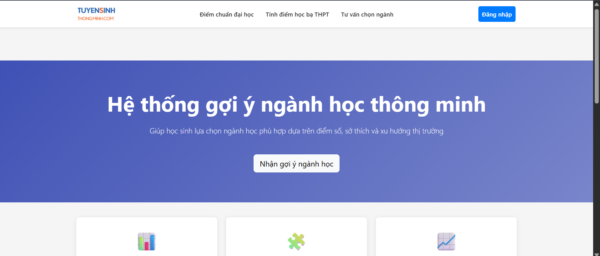
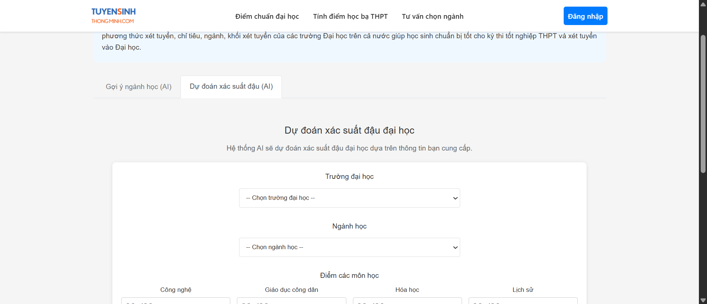
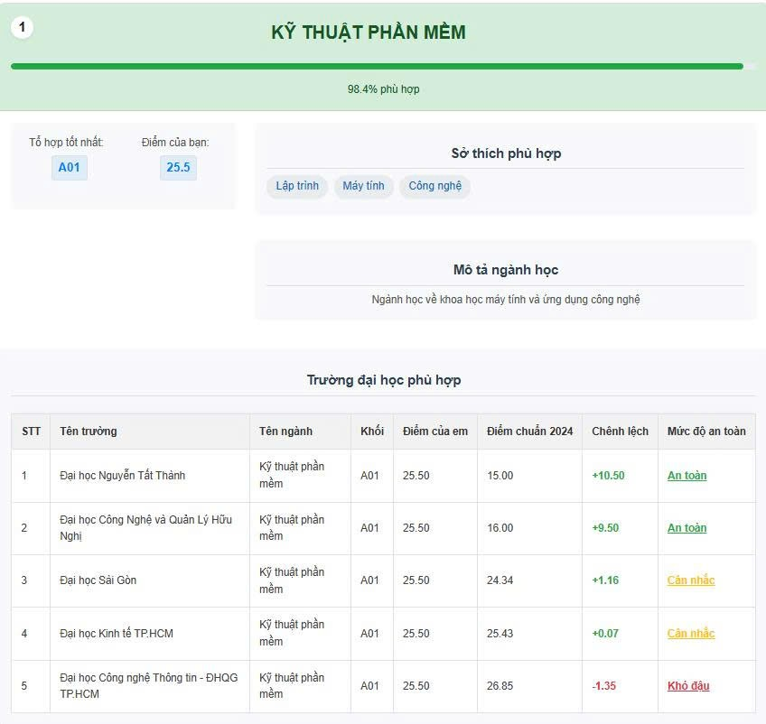
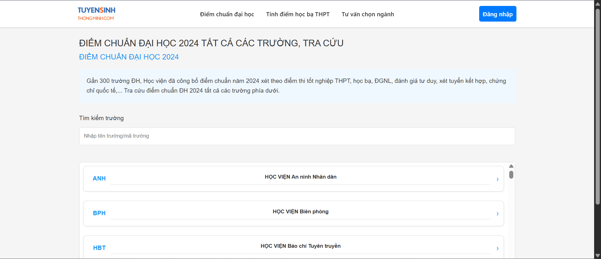
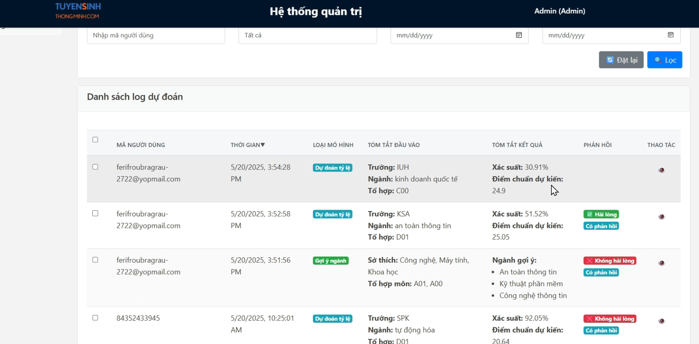

# 🎓 Tuyển Sinh Thông Minh

> Hệ thống tư vấn tuyển sinh thông minh giúp học sinh lớp 12 chọn ngành học và trường đại học phù hợp dựa trên AI


## 📋 Mục lục

- [Tính năng chính](#-tính-năng-chính)
- [Công nghệ sử dụng](#-công-nghệ-sử-dụng)
- [Mô hình AI](#-mô-hình-ai)
- [Cài đặt](#-cài-đặt)
- [Chạy ứng dụng](#-chạy-ứng-dụng)
- [Cấu trúc dự án](#-cấu-trúc-dự-án)
- [Screenshots](#-screenshots)
- [API Endpoints](#-api-endpoints)
- [Xử lý lỗi](#-xử-lý-lỗi)
- [Contributing](#-contributing)

## ✨ Tính năng chính

- 🔍 **Tìm kiếm trường đại học và ngành học** - Tra cứu thông tin chi tiết các trường đại học và ngành học tại Việt Nam
- 📊 **Tra cứu điểm chuẩn** - Xem điểm chuẩn các năm gần đây của từng trường/ngành
- 🤖 **Gợi ý ngành học bằng AI** - Hệ thống sử dụng mạng neural network để gợi ý ngành học phù hợp dựa trên:
  - Điểm số học tập/thi cử
  - Sở thích cá nhân
  - Tổ hợp môn thi (KHTN/KHXH)
- 🎯 **Dự đoán xác suất đậu đại học** - Dự đoán khả năng trúng tuyển vào trường/ngành cụ thể với độ chính xác cao
- 🧮 **Tính toán điểm xét tuyển** - Tự động tính điểm theo từng tổ hợp môn
- 💬 **Tư vấn chọn trường và ngành** - Gợi ý các lựa chọn phù hợp với năng lực và sở thích

## 🛠 Công nghệ sử dụng

### Backend Node.js
- **Node.js & Express** - RESTful API server
- **MongoDB với Mongoose** - Database và ODM
- **JWT Authentication** - Xác thực và phân quyền

### Backend Python (AI)
- **Flask** - API framework
- **TensorFlow/Keras** - Deep learning models
- **Scikit-learn** - Machine learning utilities
- **NumPy/Pandas** - Xử lý dữ liệu

### Frontend
- **React 18** - UI framework
- **Material-UI (MUI)** - Component library
- **Ant Design** - Additional UI components
- **React Query** - Data fetching và caching
- **React Router** - Routing
- **Chart.js** - Data visualization

## 🤖 Mô hình AI

### 1. Mô hình gợi ý ngành học

Sử dụng mạng neural network để gợi ý ngành học phù hợp dựa trên:
- Điểm thi/học bạ các môn học
- Tổ hợp thi (KHTN/KHXH)
- Sở thích cá nhân
- Xu hướng thị trường lao động

**Vị trí:** `BE_python/ai_models/goiynganhhoc/`

### 2. Mô hình dự đoán xác suất đậu đại học

Dự đoán xác suất trúng tuyển vào trường/ngành cụ thể dựa trên:
- Điểm thi của học sinh
- Điểm chuẩn trung bình của trường/ngành
- Chỉ tiêu tuyển sinh
- Xu hướng điểm chuẩn qua các năm
- Độ phổ biến của ngành

**Vị trí:** `BE_python/ai_models/dudoanxacxuat/`

## 💻 Cài đặt

### Yêu cầu hệ thống
- Node.js (>= 14.x)
- Python (>= 3.8)
- MongoDB

### Cài đặt thư viện

#### 1. Thư viện Node.js
```bash
# Backend
cd backend
npm install

# Frontend
cd frontend
npm install
```

#### 2. Thư viện Python
```bash
cd BE_python
pip install -r requirements.txt
```

## 🚀 Chạy ứng dụng

### Cách 1: Sử dụng script tự động (Windows)

Để chạy tất cả các thành phần cùng lúc:
```bash
start-servers.bat
```

Script này sẽ:
1. ✅ Cài đặt các thư viện Python cần thiết
2. ✅ Khởi động Python API server (port 5000)
3. ✅ Khởi động Node.js API server (port 5001)
4. ✅ Khởi động React frontend (port 3000)

### Cách 2: Khởi động thủ công

Mở 3 cửa sổ terminal riêng:

#### Terminal 1: Python API
```bash
cd BE_python
python app.py
```
Server chạy tại: `http://localhost:5000`

#### Terminal 2: Node.js API
```bash
cd backend
npm start
```
Server chạy tại: `http://localhost:5001`

#### Terminal 3: Frontend
```bash
cd frontend
npm start
```
Ứng dụng chạy tại: `http://localhost:3000`

## 📁 Cấu trúc dự án

```
TuyenSinhThongMinh-monorepo/
├── backend/                    # Backend API server (Node.js/Express)
│   ├── controllers/           # Business logic
│   ├── models/                # MongoDB schemas
│   ├── routes/                # API routes
│   ├── middleware/            # Authentication & validation
│   └── utils/                 # Utility functions
│
├── frontend/                   # Frontend React application
│   ├── src/
│   │   ├── Components/        # React components
│   │   ├── services/          # API services
│   │   └── hooks/             # Custom React hooks
│   └── public/                # Static assets
│
├── BE_python/                  # Python backend cho AI models
│   ├── ai_models/
│   │   ├── goiynganhhoc/      # Mô hình gợi ý ngành học
│   │   └── dudoanxacxuat/     # Mô hình dự đoán xác suất
│   ├── api/                   # Flask API endpoints
│   └── utils/                 # Python utilities
│
└── shared/                     # Shared utilities
    └── src/                    # Shared source code
```

## 📸 Screenshots

### Trang chủ / Dashboard


### Dự đoán xác suất đậu đại học


### Gợi ý ngành học


### Tra cứu trường đại học


### Trang quản trị


## 📡 API Endpoints

### Backend Node.js (Port 5001)

#### Authentication
- `POST /api/auth/check-phone` - Kiểm tra số điện thoại và gửi OTP
- `POST /api/auth/verify-otp` - Xác thực OTP
- `POST /api/auth/register` - Đăng ký tài khoản
- `POST /api/auth/login` - Đăng nhập
- `POST /api/auth/forgot-password` - Quên mật khẩu
- `POST /api/auth/reset-password` - Đặt lại mật khẩu

#### Universities
- `GET /api/universities` - Lấy danh sách trường
- `GET /api/universities/:code` - Lấy thông tin chi tiết trường
- `POST /api/universities` - Tạo trường mới (Auth required)
- `PUT /api/universities/:code` - Cập nhật thông tin trường (Auth required)
- `DELETE /api/universities/:code` - Xóa trường (Auth required)
- `POST /api/universities/import` - Import danh sách trường (Auth required)

#### Subject Combinations
- `GET /api/subject-combinations` - Lấy danh sách tổ hợp môn
- `GET /api/subject-combinations/:code` - Lấy chi tiết tổ hợp môn
- `POST /api/subject-combinations` - Tạo tổ hợp môn mới (Auth required)
- `PUT /api/subject-combinations/:code` - Cập nhật tổ hợp môn (Auth required)
- `DELETE /api/subject-combinations/:code` - Xóa tổ hợp môn (Auth required)
- `POST /api/subject-combinations/import` - Import danh sách tổ hợp môn (Auth required)

### Backend Python (Port 5000)

#### Gợi ý ngành học
- `POST /api/recommendation/recommend` - Gợi ý ngành học
- `GET /api/recommendation/health` - Kiểm tra trạng thái API

#### Dự đoán xác suất
- `POST /api/admission/predict` - Dự đoán xác suất đậu đại học
- `GET /api/admission/health` - Kiểm tra trạng thái API

#### Dữ liệu chung
- `GET /api/data/subject-combinations` - Lấy danh sách tổ hợp môn
- `GET /api/data/interests` - Lấy danh sách sở thích
- `GET /api/data/universities` - Lấy danh sách trường đại học
- `GET /api/data/majors` - Lấy danh sách ngành học
- `GET /api/data/admission-criteria` - Lấy tiêu chí tuyển sinh
- `GET /api/data/student-data/:id` - Lấy dữ liệu học sinh theo ID
- `GET /api/data/stats` - Lấy thống kê dữ liệu

## 🔧 Xử lý lỗi

### Lỗi "Không thể tải mô hình dự đoán"
Khởi tạo lại mô hình:
```bash
cd BE_python
python -m ai_models.dudoanxacxuat.initialize_model
```

### Các lỗi thường gặp khác
1. ✅ Kiểm tra MongoDB đã được khởi động
2. ✅ Kiểm tra kết nối mạng
3. ✅ Kiểm tra các port 5000, 5001 và 3000 không bị chiếm bởi ứng dụng khác
4. ✅ Kiểm tra các biến môi trường (nếu có file `.env`)
5. ✅ Kiểm tra đã cài đặt đầy đủ dependencies cho cả Node.js và Python

## 🤝 Contributing

Contributions are welcome! Please feel free to submit a Pull Request.

1. Fork repository
2. Tạo branch mới (`git checkout -b feature/AmazingFeature`)
3. Commit thay đổi (`git commit -m 'Add some AmazingFeature'`)
4. Push to branch (`git push origin feature/AmazingFeature`)
5. Tạo Pull Request

## 📄 License

Distributed under the MIT License. See `LICENSE` for more information.

---

⭐ **Nếu dự án này hữu ích, hãy cho một star!**
