# 🎓 Tuyển Sinh Thông Minh

> Hệ thống tư vấn tuyển sinh thông minh giúp học sinh lớp 12 chọn ngành học và trường đại học phù hợp dựa trên AI


## 📋 Mục lục

- [Tính năng chính](#-tính-năng-chính)
- [Công nghệ sử dụng](#-công-nghệ-sử-dụng)
- [Dữ liệu & Mô hình AI](#-dữ-liệu--mô-hình-ai)
- [Cài đặt](#-cài-đặt)
- [Chạy ứng dụng](#-chạy-ứng-dụng)
- [Cấu trúc dự án](#-cấu-trúc-dự-án)
- [Screenshots](#-screenshots)
- [API Endpoints](#-api-endpoints)
- [Xử lý lỗi](#-xử-lý-lỗi)
- [Contributing](#-contributing)

## ✨ Tính năng chính

- 🔍 **Tìm kiếm trường đại học và ngành học** - Tra cứu thông tin chi tiết các trường đại học và ngành học tại Việt Nam
- 📊 **Tra cứu điểm chuẩn** - Xem điểm chuẩn các năm gần đây của từng trường/ngành
- 🤖 **Gợi ý ngành học bằng AI** - Hệ thống sử dụng mạng neural network để gợi ý ngành học phù hợp dựa trên:
  - Điểm số học tập/thi cử
  - Sở thích cá nhân
  - Tổ hợp môn thi (KHTN/KHXH)
- 🎯 **Dự đoán xác suất đậu đại học** - Dự đoán khả năng trúng tuyển vào trường/ngành cụ thể với độ chính xác cao
- 🧮 **Tính toán điểm xét tuyển** - Tự động tính điểm xét tuyển học bạ theo nhiều phương thức (trung bình môn, học kỳ, cả năm)
- 💬 **Tư vấn chọn trường và ngành** - Gợi ý các lựa chọn phù hợp nhất với năng lực học thuật và sở thích cá nhân

## 🛠 Công nghệ sử dụng

### Backend Node.js
- **Node.js & Express** - RESTful API server chính
- **MongoDB với Mongoose** - Cơ sở dữ liệu NoSQL và ODM
- **JWT Authentication** - Xác thực, phân quyền tài khoản (User/Admin)

### Backend Python (AI Core)
- **Flask** - API framework phục vụ mô hình học máy
- **TensorFlow / Keras** - Xây dựng và huấn luyện mạng nơ-ron sâu (Deep Learning)
- **Scikit-learn** - Chuẩn hóa dữ liệu (StandardScaler) và tính toán các độ đo đánh giá
- **NumPy & Pandas** - Xử lý, phân tích dữ liệu dạng bảng

### Frontend
- **React 18** - Thư viện xây dựng giao diện người dùng
- **Material-UI (MUI) & Ant Design** - Hệ thống UI Component libraries chuyên nghiệp
- **React Query** - Quản lý trạng thái bất đồng bộ, fetching và caching dữ liệu hiệu quả
- **React Router** - Điều hướng và phân luồng ứng dụng
- **Chart.js** - Trực quan hóa dữ liệu điểm số, phân phối khối và biểu đồ tương quan

## 🤖 Dữ liệu & Mô hình AI

Hệ thống được cung cấp sức mạnh bởi các mô hình học sâu (Deep Learning) được nghiên cứu bài bản, xử lý triệt để các bài toán thực tế của giáo dục Việt Nam.

### 1. Tập dữ liệu & Tiền xử lý (Dataset & Preprocessing)
- **Dữ liệu điểm thi thực tế:** ~7 triệu bản ghi điểm thi THPT Quốc gia (giai đoạn 2017-2024) được thu thập chính thức bằng kỹ thuật Web Scraping, đảm bảo tính xác thực cao.
- **Dữ liệu điểm chuẩn:** Tự động thu thập từ thông báo tuyển sinh của các trường đại học và nền tảng lớn (VnExpress) từ 2020-2024 sử dụng **Selenium**.
- **Xu hướng thị trường (Market Trends):** Tổng hợp từ báo cáo nhân sự chuyên nghiệp của Cục Thống kê Lao động Việt Nam, VietnamWorks, TopCV và LinkedIn.
- **Xử lý dữ liệu mất cân bằng (Imbalanced Data):** Tần suất phân bố ngành học tuân theo quy luật mũ (power law). Hệ thống áp dụng phương pháp **Trọng số ngược với tần suất lớp (Inverse Class Frequency)** với giới hạn tối đa $w_{max} = 50$ để tránh hiện tượng Overfitting vào các ngành học phổ biến và tăng cường recall cho các ngành hiếm.
- **Chuẩn hóa:** Toàn bộ điểm số được chuẩn hóa về phân phối chuẩn (StandardScaler) có trung bình bằng 0 và độ lệch chuẩn bằng 1 trước khi đưa vào mô hình.

### 2. Mô hình gợi ý ngành học (Major Recommendation Model)
Mô hình sử dụng kiến trúc **Mạng nơ-ron đa đầu ra (Multi-output Neural Network)** kết hợp cơ chế học tầng chia sẻ (Shared Layers) để tối ưu hóa các đặc trưng chung giữa các khối ngành học.

* **Cấu trúc mạng:**
  - Lớp Input (kích thước vector đặc trưng: Điểm số, Sở thích mã hóa nhị phân, Tổ hợp môn, Khối thi).
  - Lớp ẩn 1: Dense 128 nodes (Hàm kích hoạt `ReLU`, BatchNormalization, Dropout 0.4).
  - Lớp ẩn 2: Dense 64 nodes (Hàm kích hoạt `ReLU`, BatchNormalization, Dropout 0.5).
  - Kiến trúc đầu ra song song: Single-output (kết hợp Attention Mechanism qua hàm `tanh`) hoặc Multi-output (mỗi ngành học ứng với 1 node đầu ra sử dụng hàm `sigmoid` và hàm mất mát tùy chỉnh Custom Weighted Binary Cross-Entropy).
* **Hiệu suất mô hình (Đánh giá độc lập trên tập kiểm tra 6.000 mẫu):**
  - **Top-1 Accuracy:** 52.58% (Gợi ý chính xác ngành học phù hợp ngay ở vị trí đầu tiên)
  - **Top-3 Accuracy:** 78.43% (Hơn 3/4 người dùng tìm thấy ngành phù hợp nằm trong top 3 đề xuất)
  - **Precision:** 58.71% | **Recall:** 53.67% | **F1 Score:** 52.08%
  - *Đặc biệt:* Mô hình đạt Recall lên tới **88.8%** đối với các ngành học phổ biến nhờ chiến lược cân bằng trọng số.

**Vị trí mã nguồn:** `BE_python/ai_models/goiynganhhoc/`

### 3. Mô hình dự đoán xác suất đậu đại học (Admission Prediction Model)
Sử dụng mô hình **Mạng nơ-ron truyền thẳng (Feedforward Neural Network) 3 tầng** để tính toán xác suất trúng tuyển theo thời gian thực dựa trên xu hướng điểm số biến động.

* **Cấu trúc mạng:**
  - Tầng đầu vào: 8 neuron tương ứng với 8 đặc trưng cốt lõi (Điểm học sinh kèm điểm cộng, Điểm chuẩn trung bình, Điểm chuẩn dự kiến, Chênh lệch điểm, Chỉ tiêu tuyển sinh hiện tại, Chỉ tiêu trung bình $q_0$, Xu hướng thị trường và Hệ số xu hướng điểm chuẩn qua các năm).
  - Tầng ẩn 1: 16 neuron (Hàm kích hoạt `ReLU`, Dropout 0.5).
  - Tầng ẩn 2: 8 neuron (Hàm kích hoạt `ReLU`).
  - Tầng đầu ra: 1 neuron (Hàm kích hoạt `sigmoid` đưa ra xác suất từ 0 - 1).
* **Thuật toán huấn luyện:** SGD (Stochastic Gradient Descent), Learning rate = 0.01, Hàm mất mát Mean Squared Error (MSE), số epoch tối đa 32 tích hợp Early Stopping sau 10 epoch không cải thiện `val_loss`.
* **Hiệu suất mô hình (Đánh giá theo quy mô tập huấn luyện tăng dần - Train size 10.000 mẫu):**
  - **MSE (Mean Squared Error):** 0.007 (Sai số cực kỳ nhỏ)
  - **RMSE (Root Mean Squared Error):** 0.088
  - **R² Score:** 0.943 (Mô hình giải thích được tới **94.3%** sự biến thiên của dữ liệu thực tế)
  - **ROC-AUC Score:** 0.998 (Khả năng phân biệt và phân loại đậu/rớt tiệm cận mức hoàn hảo)

**Vị trí mã nguồn:** `BE_python/ai_models/dudoanxacxuat/`

## 💻 Cài đặt

### Yêu cầu hệ thống
- Node.js (>= 14.x)
- Python (>= 3.8)
- MongoDB (đang chạy cục bộ hoặc đám mây)

### Cài đặt thư viện

#### 1. Thư viện Node.js
```bash
# Cài đặt cho Backend API
cd backend
npm install

# Cài đặt cho Frontend React
cd ../frontend
npm install
```

#### 2. Thư viện Python
```bash
cd BE_python
pip install -r requirements.txt
```

## 🚀 Chạy ứng dụng

### Cách 1: Sử dụng script tự động (Windows)

Để chạy tất cả các thành phần cùng lúc:
```bash
start-servers.bat
```

Script này sẽ:
1. ✅ Cài đặt các thư viện Python cần thiết
2. ✅ Khởi động Python API server (port 5000)
3. ✅ Khởi động Node.js API server (port 5001)
4. ✅ Khởi động React frontend (port 3000)

### Cách 2: Khởi động thủ công

Mở 3 cửa sổ terminal riêng:

#### Terminal 1: Python API
```bash
cd BE_python
python app.py
```
Server chạy tại: `http://localhost:5000`

#### Terminal 2: Node.js API
```bash
cd backend
npm start
```
Server chạy tại: `http://localhost:5001`

#### Terminal 3: Frontend
```bash
cd frontend
npm start
```
Ứng dụng chạy tại: `http://localhost:3000`

## 📁 Cấu trúc dự án

```
TuyenSinhThongMinh-monorepo/
├── backend/                    # Backend API server (Node.js/Express)
│   ├── controllers/           # Business logic
│   ├── models/                # MongoDB schemas
│   ├── routes/                # API routes
│   ├── middleware/            # Authentication & validation
│   └── utils/                 # Utility functions
│
├── frontend/                   # Frontend React application
│   ├── src/
│   │   ├── Components/        # React components
│   │   ├── services/          # API services
│   │   └── hooks/             # Custom React hooks
│   └── public/                # Static assets
│
├── BE_python/                  # Python backend cho AI models
│   ├── ai_models/
│   │   ├── goiynganhhoc/      # Mô hình gợi ý ngành học
│   │   └── dudoanxacxuat/     # Mô hình dự đoán xác suất
│   ├── api/                   # Flask API endpoints
│   └── utils/                 # Python utilities
│
└── shared/                     # Shared utilities
    └── src/                    # Shared source code
```

## 📸 Screenshots

### Trang chủ / Dashboard
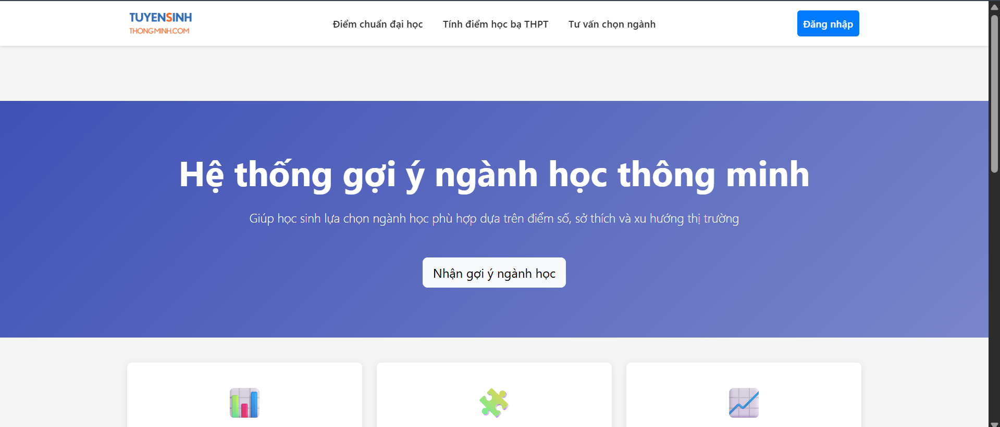

### Đăng nhập / Đăng ký
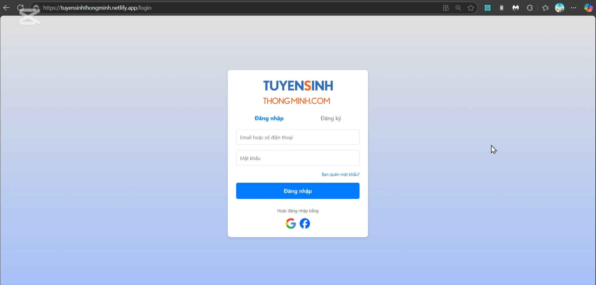

### Dự đoán xác suất đậu đại học
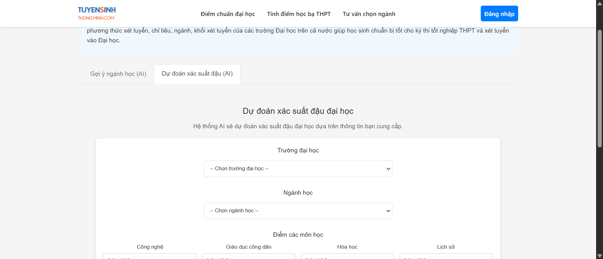

### Kết quả dự đoán
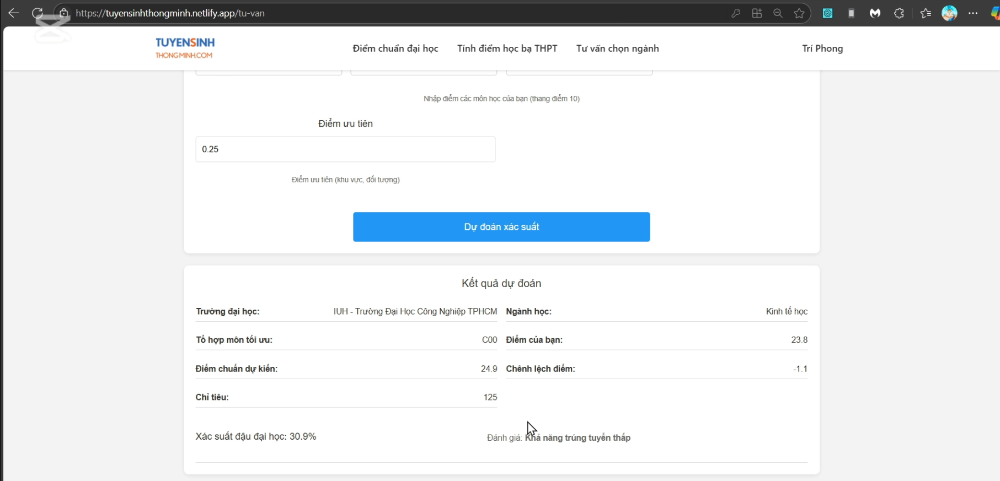

### Gợi ý ngành học - Nhập thông tin
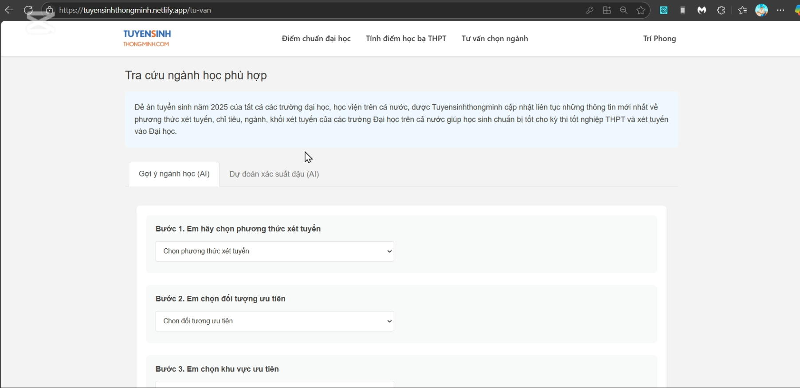

### Gợi ý ngành học - Mở rộng
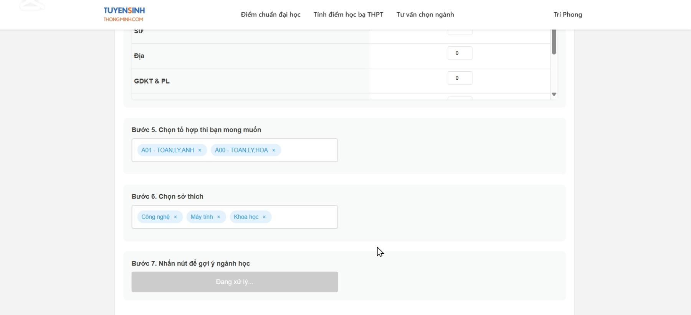

### Kết quả gợi ý ngành học
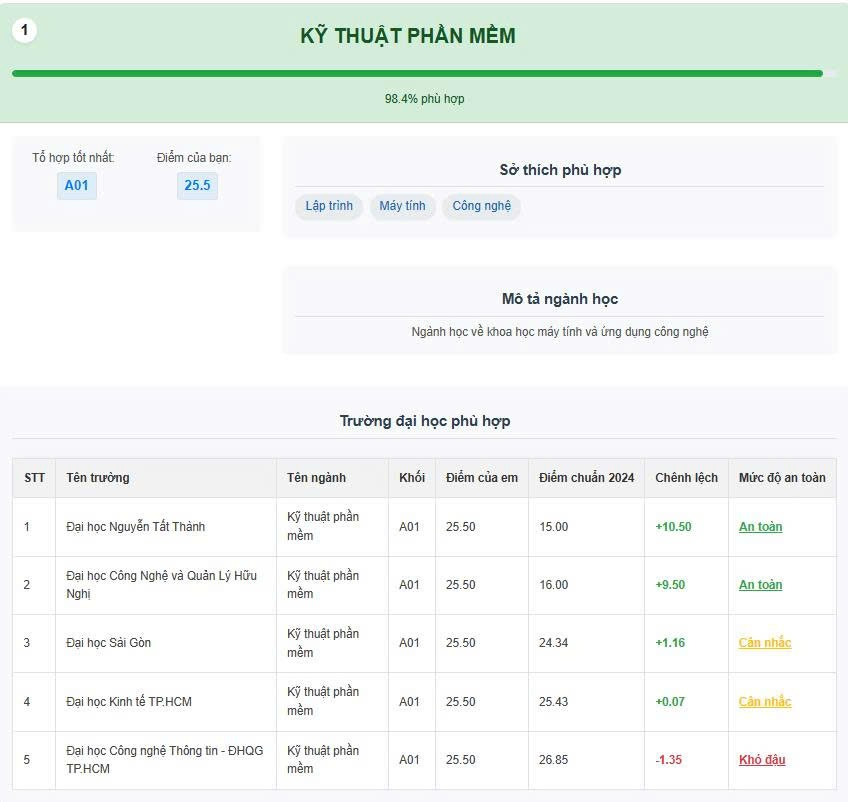

### Tra cứu trường đại học
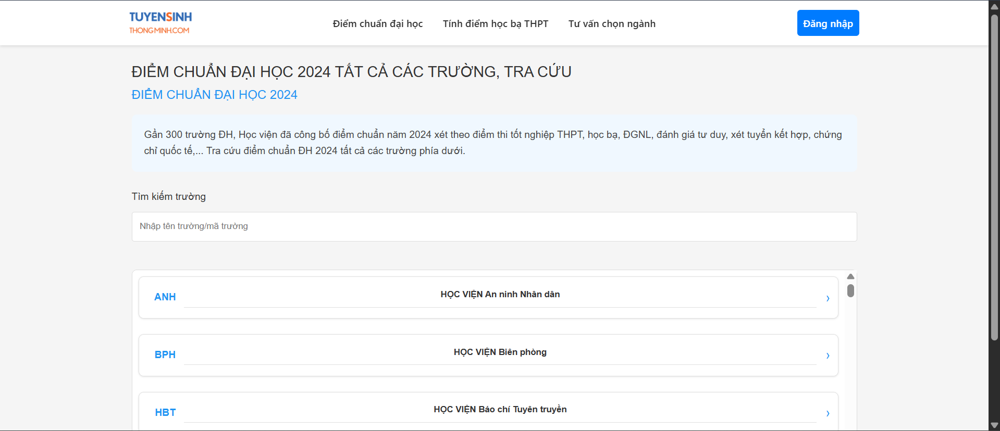

### Kết quả tra cứu trường
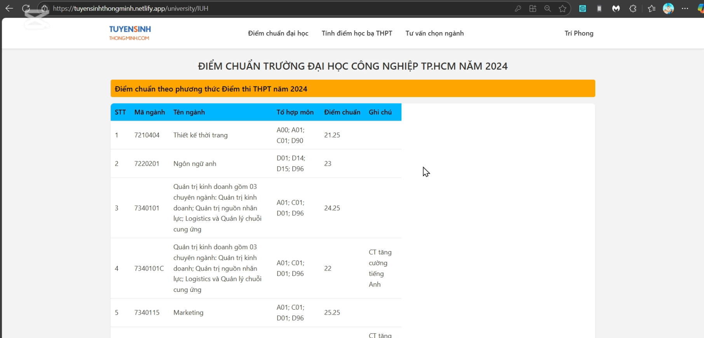

### Lịch sử dự đoán
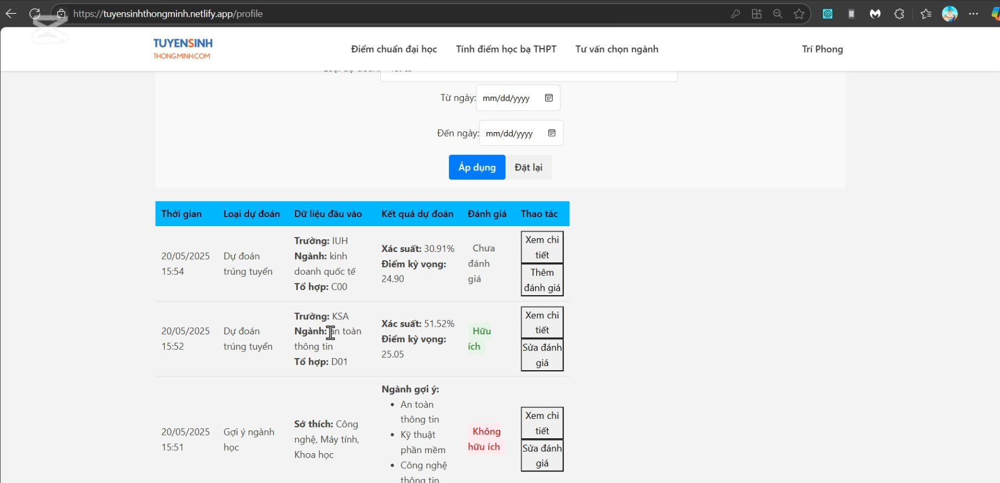

### Gửi phản hồi
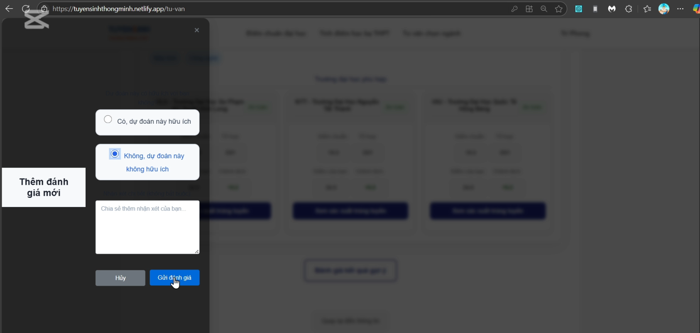

### Quản lý log, thu thập dữ liệu retrain
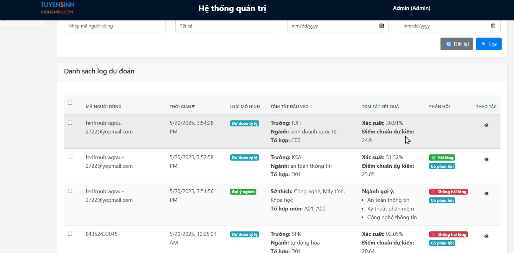

### Quản lý người dùng
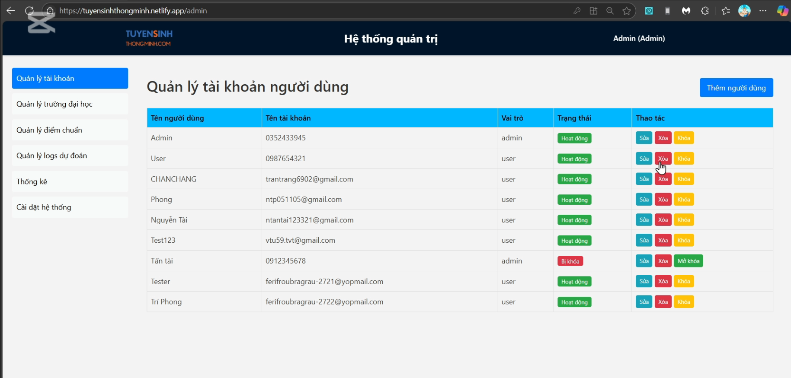

### Quản lý trường đại học
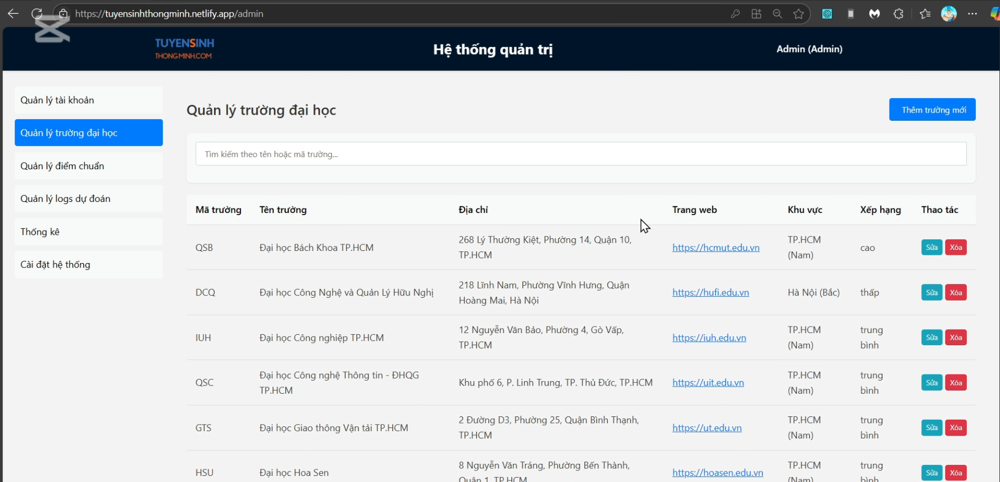

## 📡 API Endpoints

### Backend Node.js (Port 5001)

#### Authentication
- `POST /api/auth/check-phone` - Kiểm tra số điện thoại và gửi OTP
- `POST /api/auth/verify-otp` - Xác thực OTP
- `POST /api/auth/register` - Đăng ký tài khoản
- `POST /api/auth/login` - Đăng nhập
- `POST /api/auth/forgot-password` - Quên mật khẩu
- `POST /api/auth/reset-password` - Đặt lại mật khẩu

#### Universities
- `GET /api/universities` - Lấy danh sách trường
- `GET /api/universities/:code` - Lấy thông tin chi tiết trường
- `POST /api/universities` - Tạo trường mới (Auth required)
- `PUT /api/universities/:code` - Cập nhật thông tin trường (Auth required)
- `DELETE /api/universities/:code` - Xóa trường (Auth required)
- `POST /api/universities/import` - Import danh sách trường (Auth required)

#### Subject Combinations
- `GET /api/subject-combinations` - Lấy danh sách tổ hợp môn
- `GET /api/subject-combinations/:code` - Lấy chi tiết tổ hợp môn
- `POST /api/subject-combinations` - Tạo tổ hợp môn mới (Auth required)
- `PUT /api/subject-combinations/:code` - Cập nhật tổ hợp môn (Auth required)
- `DELETE /api/subject-combinations/:code` - Xóa tổ hợp môn (Auth required)
- `POST /api/subject-combinations/import` - Import danh sách tổ hợp môn (Auth required)

### Backend Python (Port 5000)

#### Gợi ý ngành học
- `POST /api/recommendation/recommend` - Gợi ý ngành học
- `GET /api/recommendation/health` - Kiểm tra trạng thái API

#### Dự đoán xác suất
- `POST /api/admission/predict` - Dự đoán xác suất đậu đại học
- `GET /api/admission/health` - Kiểm tra trạng thái API

#### Dữ liệu chung
- `GET /api/data/subject-combinations` - Lấy danh sách tổ hợp môn
- `GET /api/data/interests` - Lấy danh sách sở thích
- `GET /api/data/universities` - Lấy danh sách trường đại học
- `GET /api/data/majors` - Lấy danh sách ngành học
- `GET /api/data/admission-criteria` - Lấy tiêu chí tuyển sinh
- `GET /api/data/student-data/:id` - Lấy dữ liệu học sinh theo ID
- `GET /api/data/stats` - Lấy thống kê dữ liệu

## 🔧 Xử lý lỗi

### Lỗi "Không thể tải mô hình dự đoán"
Khởi tạo lại mô hình:
```bash
cd BE_python
python -m ai_models.dudoanxacxuat.initialize_model
```

### Các lỗi thường gặp khác
1. ✅ Kiểm tra MongoDB đã được khởi động
2. ✅ Kiểm tra kết nối mạng
3. ✅ Kiểm tra các port 5000, 5001 và 3000 không bị chiếm bởi ứng dụng khác
4. ✅ Kiểm tra các biến môi trường (nếu có file `.env`)
5. ✅ Kiểm tra đã cài đặt đầy đủ dependencies cho cả Node.js và Python

## 🤝 Contributing

Contributions are welcome! Please feel free to submit a Pull Request.

1. Fork repository
2. Tạo branch mới (`git checkout -b feature/AmazingFeature`)
3. Commit thay đổi (`git commit -m 'Add some AmazingFeature'`)
4. Push to branch (`git push origin feature/AmazingFeature`)
5. Tạo Pull Request

## 📄 License

Distributed under the MIT License. See `LICENSE` for more information.

---

⭐ **Nếu dự án này hữu ích, hãy cho một star!**
